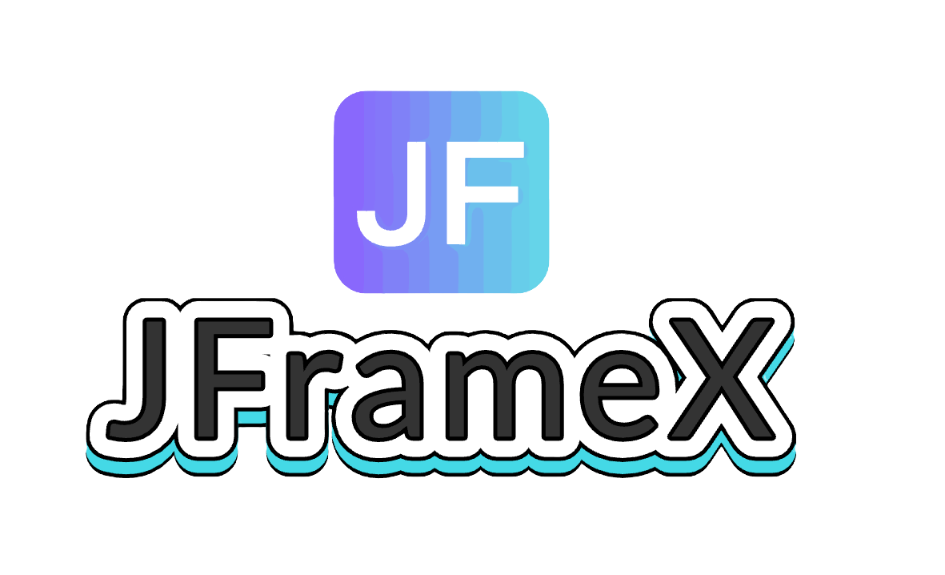
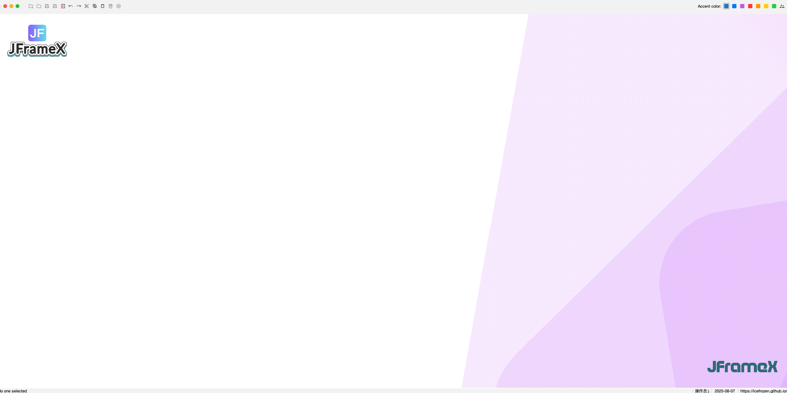
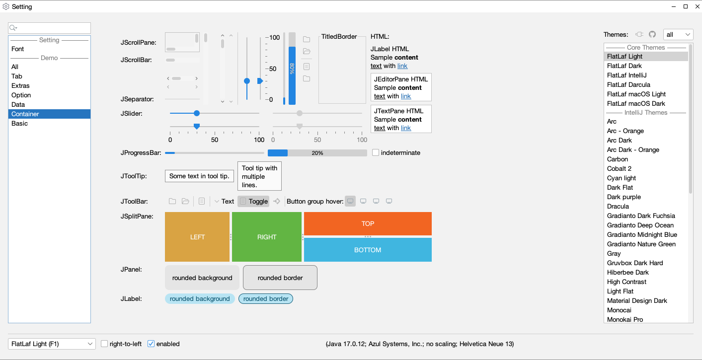
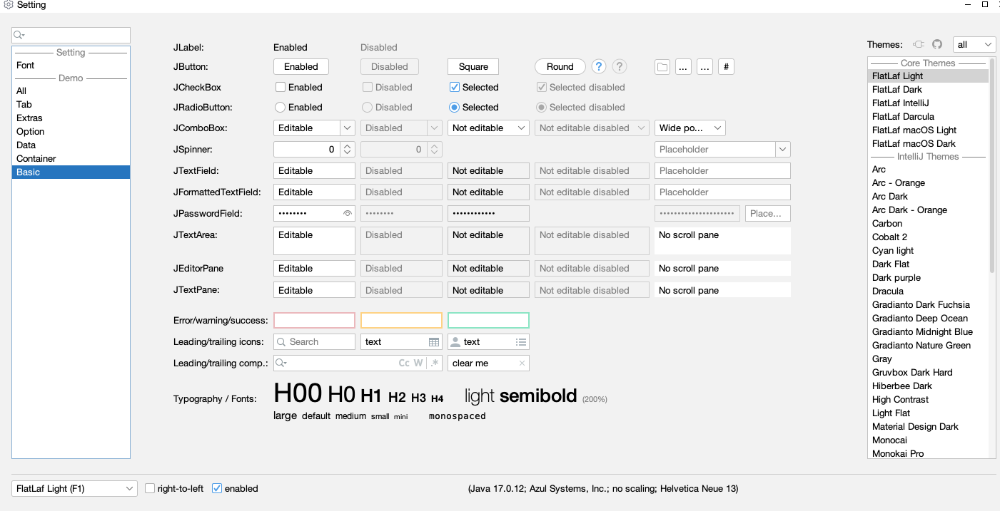
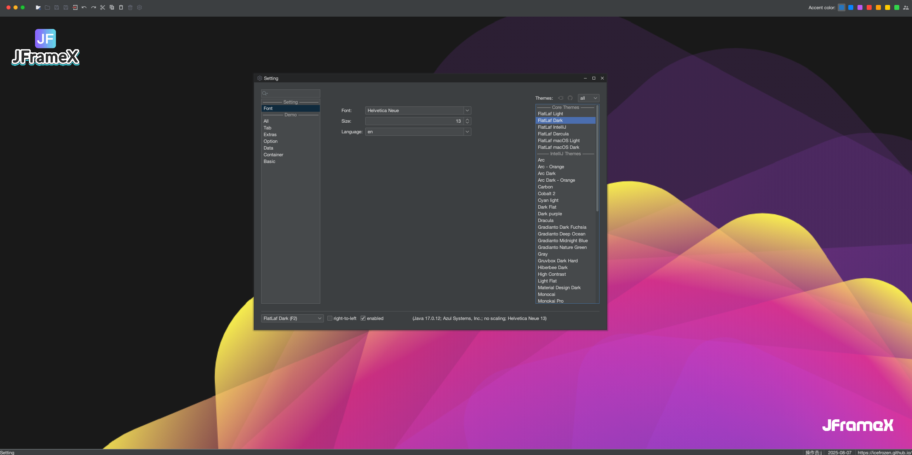
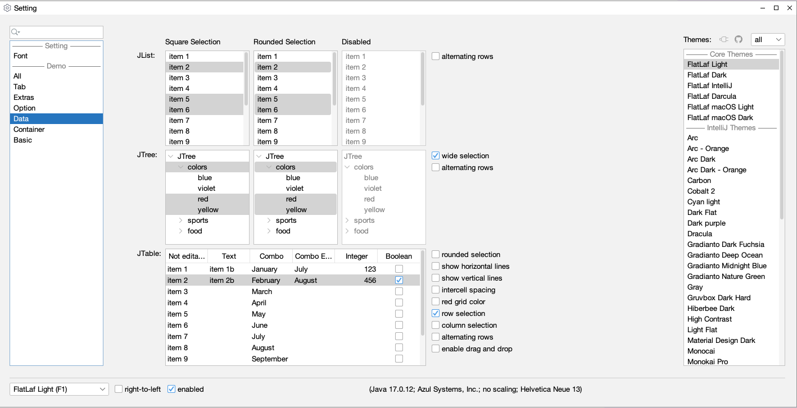
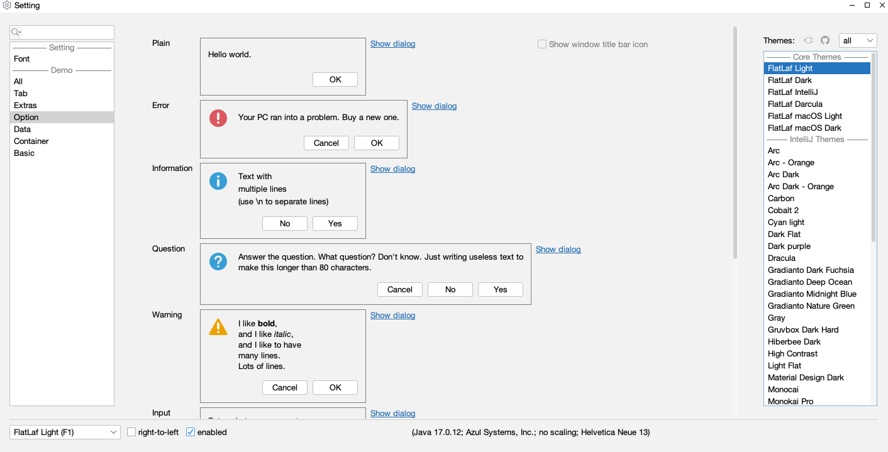
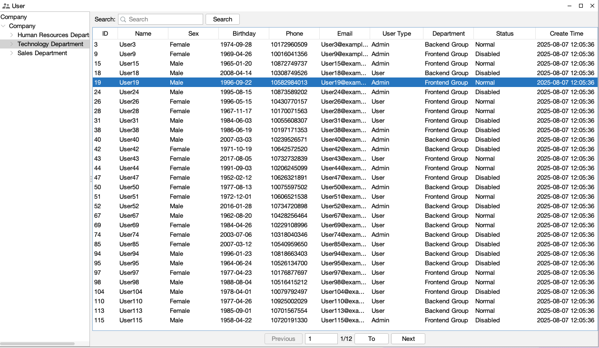

  

  A modern, internationalized Java Swing desktop application framework with rich UI components

  
  
  
  

## 🌟 Features

JFrameX is a comprehensive Java Swing desktop application framework that provides a rich set of features for building modern desktop applications with minimal effort.

### 🌍 Internationalization Support

JFrameX comes with built-in internationalization support, allowing your application to be easily translated into multiple languages.

- ✅ English (Default)
- ✅ Chinese (Simplified)
- ✅ Easy to extend to other languages

### 🎨 Theme Support

JFrameX supports multiple themes through FlatLaf, providing a modern look and feel for your applications.

- ✅ Light and Dark themes
- ✅ Multiple built-in theme options
- ✅ Custom theme support
- ✅ Runtime theme switching

### 🧩 Rich UI Components

JFrameX includes a wide variety of pre-built UI components that follow modern design principles.

- ✅ Basic Components (Buttons, Text Fields, Labels, etc.)
- ✅ Container Components (Panels, Split Panes, Tabbed Panes, etc.)
- ✅ Data Components (Tables, Lists, Trees, etc.)
- ✅ Custom Dialogs and Forms
- ✅ Advanced Components (Charts, Progress Bars, etc.)

### 🔧 Development Features

JFrameX is designed with developers in mind, providing tools and features that make development easier.

- ✅ Modular architecture based on Spring Boot
- ✅ Built-in permission management system
- ✅ Resource loading and management

## 🛠️ Technology Stack

- **Java 17+** - Modern Java features and performance
- **Spring Boot 2.7+** - Dependency injection and application framework
- **FlatLaf** - Modern look and feel for Swing applications
- **Lombok** - Reduced boilerplate code
- **MigLayout** - Powerful layout manager
- **Maven** - Build automation and dependency management

## 🛠️ Demo 

  

---

  

  

  

  

  

  

  

  

  

  

Made with ❤️ by the ximuli
